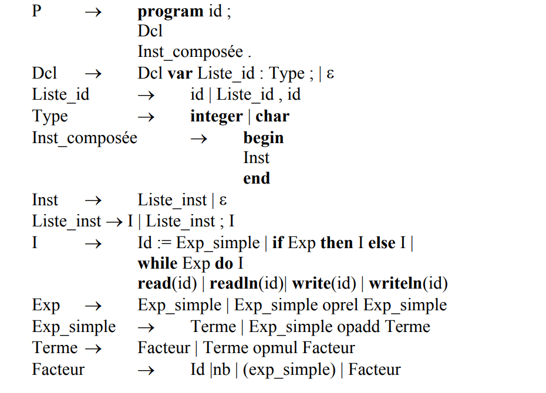
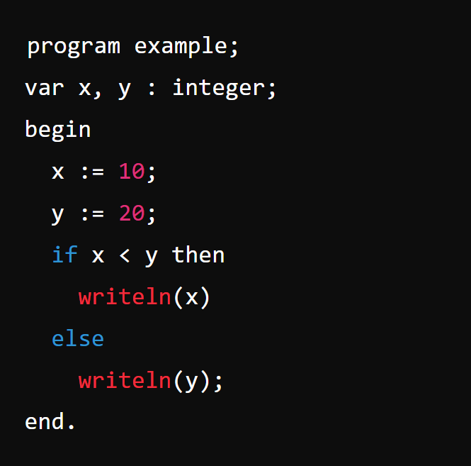

# compilateur-program-pascal

## Description

Ce projet est un compilateur développé dans le cadre d'un mini-projet de compilation pour l'École Nationale des Sciences de l’Informatique (ENSI) pour l'année universitaire 2023-2024. Le compilateur prend en entrée un programme écrit dans un langage spécifique et effectue les tâches suivantes :
- Analyse lexicale
- Analyse syntaxique
- Contrôles sémantiques
- Génération de code intermédiaire pour une machine abstraite à pile

## Grammaire Utilisée

La grammaire de base utilisée pour ce compilateur est la suivante :



## Conventions Lexicales

- Les commentaires sont entre `(*` et `*)`.
- Les blancs entre les unités lexicales sont optionnels, excepté pour les mots clés qui doivent être entourés par des blancs, des fins de lignes, le début du programme ou le point final.
- Les identificateurs sont formés d’une lettre suivie éventuellement de lettres ou de chiffres.
- Les entiers non signés : `[0-9]+`.
- Les mots clés apparaissent en gras dans la grammaire.
- Les opérateurs relationnels : `=, <>, <, <=, >, >=`.
- Les opérateurs arithmétiques : `+, -, ||, *, /, %, &&`.

## Fonctionnalités

- **Analyse Lexicale :** Identification et classification des lexèmes présents dans le programme source.
- **Analyse Syntaxique :** Vérification de la structure grammaticale du programme selon la grammaire spécifiée.
- **Contrôles Sémantiques :** Vérification des types des expressions pour assurer la cohérence des types.
- **Génération de Code Intermédiaire :** Production d'un code intermédiaire pour une machine abstraite à pile.

## Structure du Projet

- `main.c` : Contient l'implémentation de l'analyseur lexical, de l'analyseur syntaxique, des contrôles sémantiques et de la génération de code intermédiaire.
- `text.txt` : Fichier source d'exemple à analyser.

## Utilisation

1. **Compiler le programme :**

   ```bash
   gcc main.c -o compilateur

2. **Exécuter le programme :**
   ```bash
   ./compilateur
Assurez-vous que le fichier text.txt contenant le programme source à analyser se trouve dans le même répertoire que l'exécutable.

## Exemple
Exemple de contenu de `text.txt` :


## Auteur
**Hassen Gadacha**- Étudiant en deuxième année d'ingénierie informatique à l'ENSI.


## Licence
Ce projet est sous licence MIT - voir le fichier LICENSE pour plus de détails.
